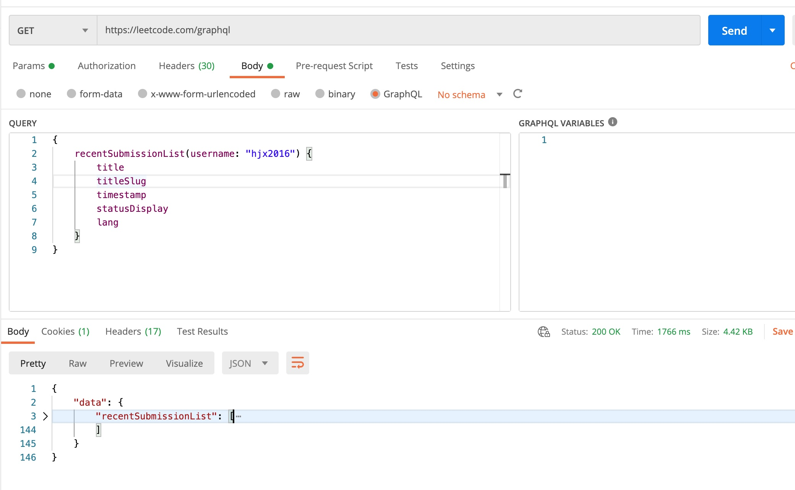
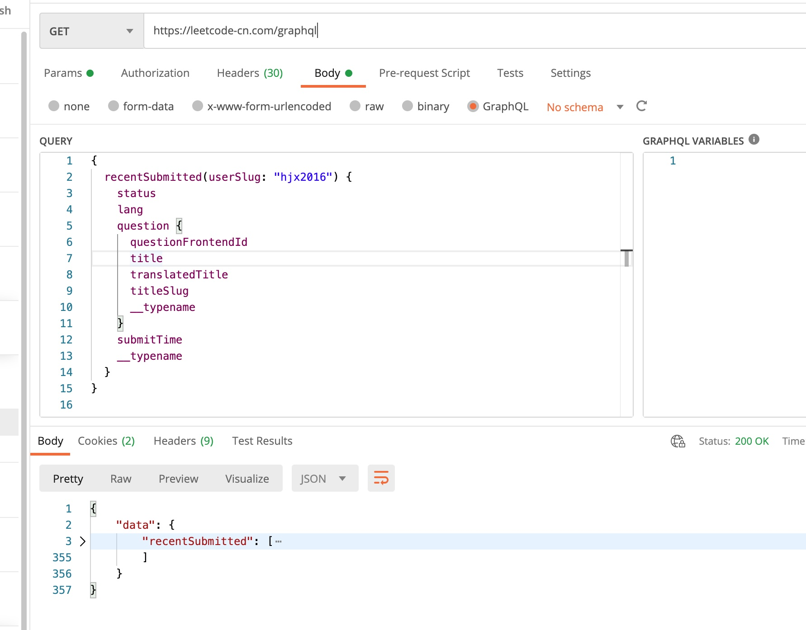

## 1. 如何获取leetcode个人最近提交题目信息
- 美服
    - 可使用postman，发送graphql类型的body来实现对单个用户最近提交问题的情况。
    
    - 使用如下curl命令行
        ```
        curl --location --request POST 'https://leetcode.com/graphql/' --header 'Content-Type: application/json' --header 'Cookie: csrftoken=4imRZt9Qzfc3Gox5WJAgAr2u8aeQuU2cfbl1dCn7nVgwxjrRWrg5xY7CfidbrgiU' --data-raw '{"query":"{ \n    recentSubmissionList(username: \"hjx2016\", limit: 30) {\n        title\n        titleSlug\n        timestamp\n        statusDisplay\n        lang\n        __typename\n    }\n}","variables":{}}'
        ```
- 国服
    - postman截图如下
    
    - 使用如下curl命令行
        ```
        curl --location --request GET 'https://leetcode-cn.com/graphql' \
        --header 'Content-Type: application/json' \
        --header 'Cookie: csrftoken=45oxOwuhTj3rd7il2CfrdnJzHLTDRxz1YUMgB8WR3asLJcD5M4cvScoQbaD5aEHl; aliyungf_tc=ff84ea745a8f3a9eba595e46f6a76551165b94ff171170c5853d325127fbb455' \
        --data-raw '{"query":"{\n  recentSubmitted(userSlug: \"hjx2016\") {\n    status\n    lang\n    question {\n      questionFrontendId\n      title\n      translatedTitle\n      titleSlug\n      __typename\n    }\n    submitTime\n    __typename\n  }\n}\n","variables":{}}'
        ```

## 2. 如何获取leetcode个人周赛参加情况
- 调用周赛接口，获取所有人的周赛成绩(需要分页)，从中拿到需要人员的成绩。周赛接口为
    - 美服
    
        `https://leetcode.com/contest/api/ranking/weekly-contest-281/?pagination=1&region=global`
    - 国服

        `https://leetcode-cn.com/contest/api/ranking/weekly-contest-281/?pagination=1&region=global`


